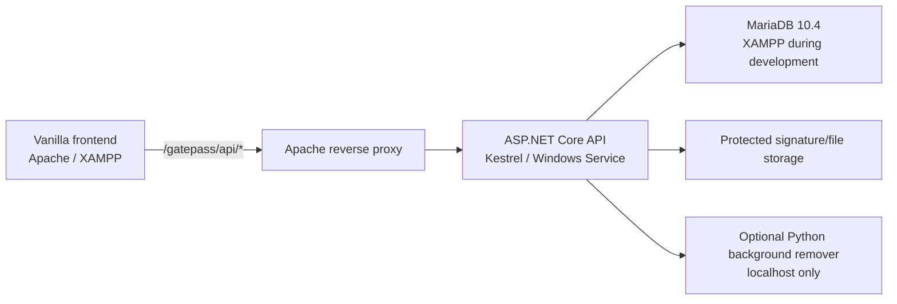

# MPI Form Request System Backend and Database Plan

Planning phase only. No backend implementation is included in this document.

## 1. Reference Scope

This plan is based on:

- `hans32116/HoWConnect`, branch `main`, commit `2d6f99f`.
- The current local `FormRequestSystem` repository.
- `CODEX_GATEPASS_SYSTEM_PLAN.txt`.
- `to codex.txt`.
- `gatepass planning.txt`.
- `employees_export_2026-06-17.xlsx`.
- The local development environment:
  - .NET SDK 8.0.411.
  - XAMPP 8.1.25.
  - MariaDB 10.4.32 on port 3306.

The HowConnect architecture is the reference pattern. Its SQL Server syntax and legacy weaknesses must not be copied directly into FormRequestSystem.

---

## 2. Executive Recommendation

Use:

- ASP.NET Core Web API.
- Recommended new-project target: .NET 10 LTS.
- Dapper for data access.
- `MySqlConnector` for MariaDB/MySQL connectivity.
- MariaDB 10.4-compatible SQL because that is the database bundled with the inspected XAMPP installation.
- SQL-first canonical scripts and numbered migrations.
- Vanilla HTML/CSS/JavaScript frontend using `Frontend/Connectors/api-client.js`.
- JWT access tokens plus a server-managed refresh-token flow.
- A separate ASP.NET process hosted by Kestrel as a Windows Service or self-contained executable.
- Apache/XAMPP only as:
  - the static frontend host;
  - an optional reverse proxy to Kestrel;
  - the current MariaDB host.

ASP.NET does not run as PHP inside XAMPP. The supported topology is:



For production, stock XAMPP should not be treated as a secure production bundle without company IT hardening. A standalone MariaDB service is preferred even if the current server continues to use Apache/XAMPP for other systems.

---

## 3. HowConnect Backend Pattern Summary

### 3.1 Solution and Project Layout

HowConnect uses two .NET projects:

1. `HoWConnectBackend`
   - Class library.
   - Models.
   - Repositories.
   - Services.
   - Password security.

2. `HoWConnectBackendAPI`
   - ASP.NET Core Web API.
   - Controllers.
   - Auth contracts.
   - JWT configuration.
   - Middleware/infrastructure.
   - `Program.cs`.

This separation is appropriate for FormRequestSystem.

### 3.2 Controllers

Observed pattern:

- `[ApiController]`.
- Routes commonly use `api/[controller]`.
- Controllers call service classes.
- Some controllers are thin.
- Some older controllers contain validation, model merging, file conversion, and error handling that should have been in services.
- Controllers return a mixture of:
  - direct models or lists;
  - `Ok(...)`;
  - `NoContent()`;
  - anonymous `{ message, error }` objects.

FormRequestSystem should retain thin controllers but use explicit routes and consistent response/error contracts.

### 3.3 DTOs and Contracts

Observed pattern:

- Auth has dedicated request/response contracts:
  - login request validation;
  - auth response;
  - current-user response;
  - change-password request.
- Many CRUD controllers still expose database models directly.

FormRequestSystem should improve this by requiring DTOs for every external API boundary. Database models must not be accepted directly from the frontend.

### 3.4 Models and Entities

Observed pattern:

- Classes are named `SomethingModel`.
- Models use:
  - `[Table]`;
  - `[Column]`;
  - `[Key]`;
  - `[NotMapped]`.
- Database columns use snake case.
- Separate model folders exist for views, aggregates, and subquery results.

FormRequestSystem should keep this recognizable naming style:

- `GatePassRequestModel`.
- `GatePassApprovalStepModel`.
- `SecurityScanResultModel`.
- `Models/Views/...`.
- `Models/Reports/...`.

### 3.5 Repositories

Observed pattern:

- `IGenericRepository<T>` provides base CRUD.
- `GenericRepository<T>` uses Dapper and reflection for table/key/column names.
- Domain repositories inherit from the generic repository.
- Specialized repositories execute:
  - direct parameterized SQL;
  - stored procedures;
  - views;
  - multi-result stored procedures through Dapper `QueryMultiple`.
- The database connection comes from an environment variable.

FormRequestSystem should retain:

- Generic repository for simple master-data CRUD.
- Specific repositories for workflow, scan, reservation, import, dashboards, and reports.
- Dapper multi-result calls for dashboard and paginated report bundles.

FormRequestSystem should improve:

- Use constructor dependency injection instead of `new Repository()` inside services.
- Use asynchronous database operations.
- Use a centralized connection factory.
- Avoid one permanently held connection per repository.
- Do not use generic repository methods for transaction-critical workflow changes.

### 3.6 Services

Observed pattern:

- Services sit between controllers and repositories.
- Services contain authentication and domain rules.
- Some services auto-provision related records.
- Specialized aggregate/view services are mostly repository pass-throughs.

FormRequestSystem services should contain the authoritative rules for:

- approval route selection;
- self-approval prevention;
- vehicle requirement validation;
- QR issuance;
- signature authorization;
- scan transition selection;
- user/role permissions;
- import validation;
- audit event creation.

### 3.7 Authentication, Users, and Roles

HowConnect uses:

- JWT bearer authentication.
- Role claims.
- PBKDF2-SHA256 salted password hashes.
- `must_change_password`.
- password-change and admin-reset flows.
- rate limiting on authentication endpoints.
- CORS restrictions.
- global exception handling.
- security headers.
- Swagger bearer-token support.

FormRequestSystem should retain these security ideas, with two improvements:

- Use ASP.NET's versioned password hasher or an equivalently versioned PBKDF2 format.
- Add refresh-token rotation and revocation so access tokens can remain short-lived.

Passwords are hashed, not encrypted.

### 3.8 Database, Migrations, and Configuration

The actual HowConnect implementation uses SQL Server/Azure SQL even though some older documentation mentions MySQL.

Its active database pattern includes:

- environment-variable connection strings;
- canonical SQL scripts in execution order;
- incremental migration scripts;
- stored procedures for CRUD, reports, and protected transactions;
- views for reusable read models;
- indexes added through dedicated scripts;
- soft-delete patterns;
- paginated stored procedures;
- multi-result stored procedures;
- transaction blocks for critical multi-table writes;
- performance-tuning migrations;
- query caching/ETags for dashboards.

No active temporary-table implementation was found in the inspected HowConnect SQL scripts. HowConnect mainly uses CTEs, views, stored procedures, and multi-result queries. FormRequestSystem will add temporary tables only where import/report reuse justifies them.

FormRequestSystem should copy the organizational pattern, not SQL Server syntax.

### 3.9 API Response Style

HowConnect's response style is currently mixed. The useful patterns are:

- typed auth responses;
- HTTP status codes;
- anonymous message objects for simple errors;
- global `{ error, traceId }` for unhandled exceptions;
- paginated/report results containing rows plus totals.

FormRequestSystem should standardize this before implementation.

---

## 4. Current FormRequestSystem Backend Assessment

### 4.1 Existing Structure

Current folders:

```text
Backend/
  Controllers/
  Project/
    DTOs/
    Models/
    Repositories/
    Services/
  SignatureBackgroundRemoval/
```

Current state:

- `Controllers` is empty.
- `DTOs`, `Models`, and `Services` are placeholders.
- Generic repository files are empty.
- No solution file or ASP.NET project exists yet.
- The optional Python signature background-removal service works separately on port 8000.
- `Backend/README.md` already identifies ASP.NET Core Web API and MySQL as the target.

### 4.2 Existing Database Draft

The current `Database/schema.sql` is a useful first normalization draft. It already includes:

- roles and permissions;
- departments and positions;
- users;
- vehicles and drivers;
- gate pass requests;
- approvals;
- scans;
- signatures;
- notifications;
- audit logs;
- two views;
- several basic indexes.

It is not yet sufficient for production because it lacks:

- employee master data separated from login users;
- multi-role users;
- refresh tokens;
- import batches and staging;
- department alias normalization;
- current/historical employee assignments;
- configurable approver assignments and fallbacks;
- approval-route snapshots;
- immutable approval actions;
- request status history;
- vehicle reservation records;
- concurrency/version columns;
- QR token lifecycle records;
- accepted movement records separate from rejected scan attempts;
- generic file metadata and signature processing history;
- schema migration history;
- stored procedures;
- database security grants;
- full dashboard/reporting views;
- transaction-safe vehicle conflict protection.

### 4.3 Existing API Connector

`Frontend/Connectors/api-client.js` currently:

- uses a hard-coded `http://127.0.0.1:5000/api`;
- always sends JSON;
- has no authentication header;
- has no refresh flow;
- has no structured error parsing;
- has no timeout or cancellation;
- has no multipart helper;
- returns raw JSON.

The backend plan remains compatible because the connector can be expanded without changing the vanilla frontend architecture.

### 4.4 Existing Frontend Authority That Must Move to the Backend

The frontend currently controls:

- login and plaintext credential checking;
- user roles;
- approval-route calculation;
- initial request status;
- approval transitions;
- QR contents;
- scan count and movement transitions;
- vehicle availability/status;
- dashboard counts;
- filtering and pagination;
- signature defaults.

All of these become backend-authoritative. The frontend should only render returned state and send user intent.

### 4.5 Gap Comparison

| Area | HowConnect reference | Current FormRequestSystem | Required GatePass direction |
| --- | --- | --- | --- |
| Solution | Two .NET projects | No `.sln` or `.csproj` | Add class library plus Web API project |
| Controllers | Many working API controllers | Empty folder | Thin explicit-route controllers |
| DTOs | Stronger for auth, inconsistent elsewhere | Empty | DTOs for every request/response |
| Models | Attribute-mapped models plus view/report models | Empty | Domain, view, and report models |
| Repositories | Dapper generic and specialized repositories | Empty generic files | Async Dapper repositories with DI |
| Services | Business/service layer exists | Empty | Workflow-focused service layer |
| Auth | JWT, PBKDF2, roles, rate limits | Frontend mock login | JWT/refresh, policies, lockout, forced change |
| Database | SQL-first scripts, migrations, SPs, views, indexes | One draft schema and seed | Canonical MariaDB scripts and migrations |
| Transactions | Used in critical stored procedures | None | Approval, scan, reservation, import transactions |
| Pagination | Stored procedures and `QueryMultiple` | Browser-array pagination | Server-side paging and totals |
| API responses | Mixed legacy shapes | Raw placeholder client | Standard data/error/paged contracts |
| Files | Some base64-in-model legacy behavior | Separate Python helper | Protected file metadata/storage and internal processing |

---

## 5. Proposed Backend Architecture

### 5.1 Target Folder Structure

```text
Backend/
  FormRequestSystem.slnx

  Project/
    FormRequestSystem.Project.csproj

    Common/
      ApiResult.cs
      PagedResult.cs
      SystemClock.cs

    DTOs/
      Auth/
      Employees/
      GatePasses/
      Approvals/
      Security/
      Fleet/
      Signatures/
      Reports/
      Admin/

    Models/
      Identity/
      Organization/
      GatePass/
      Fleet/
      Files/
      Operations/
      Views/
      Reports/

    Repositories/
      Interfaces/
      GenericRepository.cs
      UserRepository.cs
      EmployeeImportRepository.cs
      GatePassRepository.cs
      ApprovalRepository.cs
      SecurityScanRepository.cs
      VehicleRepository.cs
      SignatureRepository.cs
      DashboardRepository.cs
      AuditLogRepository.cs

    Services/
      Interfaces/
      AuthServices.cs
      UserServices.cs
      EmployeeImportServices.cs
      ApprovalRouteServices.cs
      GatePassWorkflowServices.cs
      ApprovalServices.cs
      SecurityScanServices.cs
      VehicleServices.cs
      SignatureServices.cs
      NotificationServices.cs
      DashboardServices.cs
      AuditLogServices.cs

    Security/
      PasswordSecurity.cs
      TokenSecurity.cs
      QrTokenSecurity.cs

  FormRequestSystemAPI/
    FormRequestSystemAPI.csproj
    Program.cs
    appsettings.json
    appsettings.Development.json

    Controllers/
      AuthController.cs
      GatePassRequestsController.cs
      ApprovalsController.cs
      SecurityController.cs
      EmployeesController.cs
      EmployeeImportsController.cs
      UsersController.cs
      RolesController.cs
      DepartmentsController.cs
      VehiclesController.cs
      DriversController.cs
      SignaturesController.cs
      DashboardController.cs
      ReportsController.cs
      AuditLogsController.cs
      NotificationsController.cs

    Authorization/
      PermissionRequirement.cs
      PermissionHandler.cs

    Infrastructure/
      MariaDbConnectionFactory.cs
      RequestContext.cs
      ApiExceptionMiddleware.cs
      CorrelationIdMiddleware.cs

    BackgroundJobs/
      OverdueNotificationWorker.cs
      ExpiredReservationWorker.cs
      FileCleanupWorker.cs
```

### 5.2 Dependency Direction

```text
Controller
  -> Service interface
    -> Repository interface
      -> Dapper/MySqlConnector
        -> MariaDB views, stored procedures, and tables
```

Controllers must not call Dapper or stored procedures directly.

### 5.3 Database Script Structure

```text
Database/
  Canonical/
    01_database_and_lookup_tables.sql
    02_identity_and_organization_tables.sql
    03_gatepass_and_fleet_tables.sql
    04_files_notifications_audit_tables.sql
    05_views.sql
    06_write_stored_procedures.sql
    07_read_report_stored_procedures.sql
    08_indexes_and_security_grants.sql

  Migrations/
    migration_v001_initial.sql
    migration_v002_employee_import.sql
    migration_v003_workflow.sql
    ...

  Seeds/
    seed_roles_permissions.sql
    seed_status_codes.sql
    seed_development_only.sql

  Tests/
    test_vehicle_overlap.sql
    test_approval_transitions.sql
    test_scan_idempotency.sql
```

`tbl_schema_migrations` records every applied migration and checksum.

---

## 6. Database Design Principles

### 6.1 Engine and Character Set

- Use InnoDB for every transactional table.
- Use `utf8mb4`.
- Use a consistent case-insensitive collation approved for MariaDB 10.4.
- Store timestamps in UTC.
- Convert to Asia/Manila only in API responses or frontend display.

### 6.2 Status Storage

Do not use large MariaDB `ENUM` definitions for workflow states. Use lookup tables and foreign-keyed status codes so statuses can be added safely.

Examples:

- `gate_pass_status_code`.
- `approval_status_code`.
- `vehicle_operational_status_code`.
- `reservation_status_code`.
- `scan_result_code`.

### 6.3 Current State Versus History

Keep both:

- current state on the main row for fast reads;
- immutable history/action rows for audit and reconstruction.

Examples:

- `tbl_gate_pass_requests.status_code`;
- `tbl_gate_pass_status_history`;
- `tbl_gate_pass_approval_steps.status_code`;
- `tbl_gate_pass_approval_actions`.

### 6.4 Soft Delete and Archiving

Do not hard-delete:

- users;
- employees;
- departments;
- positions;
- vehicles;
- drivers;
- gate pass transactions;
- approvals;
- scans;
- audit logs.

Use `is_active`, `is_archived`, `archived_at`, and `archived_by_user_id` as appropriate.

### 6.5 Concurrency

Critical writes use:

- InnoDB transactions;
- `SELECT ... FOR UPDATE`;
- an integer `version_no`;
- expected-status checks;
- unique constraints;
- idempotency keys for client retries.

The frontend `scanCount` must never be the source of truth.

---

## 7. Database Schema Draft

### 7.1 Identity and Authorization

#### `tbl_roles`

- `role_id`
- `role_code`
- `role_name`
- `description`
- `is_system_role`
- `is_active`
- timestamps

Initial roles:

- `ASSOCIATE`
- `IMMEDIATE_SUPERIOR`
- `PRESIDENT`
- `PAS_HR`
- `SECURITY`
- `SYSTEM_ADMIN`

#### `tbl_permissions`

- `permission_id`
- `permission_code`
- `description`

#### `tbl_role_permissions`

- `role_id`
- `permission_id`
- composite primary key

#### `tbl_users`

- `user_id`
- `employee_id` nullable foreign key
- `username`
- `password_hash`
- `account_status_code`
- `must_change_password`
- `last_password_change_at`
- `failed_login_count`
- `locked_until`
- `last_login_at`
- `can_request_gate_pass`
- `created_by_user_id`
- timestamps
- `version_no`

Security users can exist without an employee record and have `can_request_gate_pass = 0`.

#### `tbl_user_roles`

- `user_id`
- `role_id`
- `assigned_at`
- `assigned_by_user_id`
- `expires_at` nullable
- composite primary key

Multiple roles are required because an immediate superior is also an employee who may submit a request.

#### `tbl_refresh_tokens`

- `refresh_token_id`
- `user_id`
- `token_hash`
- `issued_at`
- `expires_at`
- `revoked_at`
- `replaced_by_token_id`
- `created_ip`
- `user_agent`

Only token hashes are stored.

### 7.2 Organization and Employee Master Data

#### `tbl_employees`

- `employee_id`
- `employee_no`
- `full_name`
- `last_name`
- `first_name`
- `middle_name`
- `employment_status_code`
- `classification`
- `date_hired`
- minimal fields required by FormRequestSystem
- `source_import_batch_id`
- timestamps
- `version_no`

Do not import every sensitive HR field into FormRequestSystem. TIN, SSS, PhilHealth, Pag-IBIG, home addresses, religion, blood type, and emergency details are not needed for gate pass processing.

#### `tbl_departments`

- `department_id`
- `department_code`
- `department_name`
- `is_active`
- timestamps

#### `tbl_department_aliases`

- `department_alias_id`
- `source_name`
- `department_id`
- `is_verified`
- timestamps

This table normalizes Excel values such as:

- `FINANCE`;
- `FINANCE DEPARTMENT`;
- `FINANCE AND IT DEPARTMENT`;
- `FINANCE, HR & IT DEPARTMENT`.

#### `tbl_positions`

- `position_id`
- `position_code`
- `position_name`
- `rank_level`
- `is_managerial`
- `is_active`
- timestamps

#### `tbl_position_aliases`

- `position_alias_id`
- `source_name`
- `position_id`
- `is_verified`

#### `tbl_employee_assignments`

- `employee_assignment_id`
- `employee_id`
- `department_id`
- `position_id`
- `effective_from`
- `effective_to` nullable
- `is_primary`
- `is_current`
- `source_import_batch_id`

This preserves promotion and transfer history.

#### `tbl_department_approvers`

- `department_approver_id`
- `department_id`
- `approver_user_id`
- `approval_type_code`
- `priority_order`
- `effective_from`
- `effective_to`
- `is_active`

`approval_type_code` examples:

- `IMMEDIATE_SUPERIOR`
- `FALLBACK_SUPERIOR`

#### `tbl_approval_groups`

- `approval_group_id`
- `group_code`
- `group_name`
- `is_active`

Initial groups:

- `PRESIDENT_OFFICE`
- `PAS_HR_NOTERS`

#### `tbl_approval_group_members`

- `approval_group_id`
- `user_id`
- `priority_order`
- `effective_from`
- `effective_to`
- `is_active`

This supports primary and fallback PAS/HR noters without hard-coding names in C#.

### 7.3 Employee Excel Import

#### `tbl_employee_import_batches`

- `import_batch_id`
- `original_file_name`
- `file_sha256`
- `uploaded_by_user_id`
- `uploaded_at`
- `import_mode_code`
- `status_code`
- `source_row_count`
- `valid_row_count`
- `warning_row_count`
- `error_row_count`
- `committed_at`
- `committed_by_user_id`

#### `tbl_employee_import_stage`

- `stage_row_id`
- `import_batch_id`
- `source_row_no`
- `raw_employee_no`
- `raw_full_name`
- `raw_department`
- `raw_position`
- `raw_employment_status`
- `raw_date_hired`
- normalized fields
- `validation_status_code`
- `validation_messages_json`
- `matched_employee_id`
- unique `(import_batch_id, source_row_no)`

#### Employee workbook findings

The inspected workbook has:

- one `Employees` sheet;
- used range `A1:AI312`;
- 38 repeated header rows;
- 197 employee data rows;
- 95 Active employees;
- 102 Inactive employees;
- no duplicate employee IDs among parsed employee rows;
- many department naming variants;
- spelling/name variants between interview notes and export data.

The import process must:

1. Ignore department-title rows and repeated header rows.
2. Import only fields needed by FormRequestSystem.
3. Normalize department and position names through verified alias tables.
4. Default to provisioning Active employees only.
5. Treat Inactive rows as archive candidates, never hard deletes.
6. Show unmatched aliases and possible name mismatches for admin review.
7. Require explicit commit after validation.

Permanent staging tables are used for review and audit. MariaDB temporary tables are used only inside validation/commit stored procedures.

### 7.4 Gate Pass Requests

#### `tbl_gate_pass_requests`

- `gate_pass_request_id`
- `gate_pass_no`
- `requester_user_id`
- `requester_employee_id`
- requester name/department/position snapshot fields
- `destination`
- `purpose`
- `planned_out_at`
- `expected_in_at` nullable
- `return_required`
- `vehicle_use_type_code`
- private/manual vehicle snapshot fields nullable
- `status_code`
- `current_approval_step_no`
- `submitted_at`
- `approved_at`
- `cancelled_at`
- `rejected_at`
- `actual_out_at`
- `actual_in_at`
- `valid_until`
- `created_at`
- `updated_at`
- `version_no`

`expected_in_at` is required only when `return_required = 1`.

`vehicle_use_type_code`:

- `NONE`
- `PRIVATE`
- `COMPANY`

#### `tbl_gate_pass_approval_steps`

This is the route snapshot created at submission time.

- `approval_step_id`
- `gate_pass_request_id`
- `step_no`
- `approval_type_code`
- `assigned_approver_user_id` nullable
- `assigned_approval_group_id` nullable
- `status_code`
- `required_flag`
- `available_from`
- `acted_at`
- `version_no`
- unique `(gate_pass_request_id, step_no)`

#### `tbl_gate_pass_approval_actions`

Immutable decision history:

- `approval_action_id`
- `approval_step_id`
- `actor_user_id`
- `action_code`
- `remarks`
- `signature_file_id` nullable
- `acted_at`
- `ip_address`
- `user_agent`
- `idempotency_key`

#### `tbl_gate_pass_status_history`

- `status_history_id`
- `gate_pass_request_id`
- `from_status_code`
- `to_status_code`
- `changed_by_user_id` nullable
- `reason_code`
- `remarks`
- `changed_at`
- `correlation_id`

### 7.5 QR and Security Scans

#### `tbl_gate_pass_qr_tokens`

- `qr_token_id`
- `gate_pass_request_id`
- `token_lookup_id`
- `token_hash`
- `issued_at`
- `expires_at`
- `revoked_at`
- `issued_by_user_id`
- `is_active`

QR payload:

- version marker;
- lookup ID;
- random secret.

It must not contain employee details, destination, or purpose.

#### `tbl_gate_pass_scan_attempts`

Every accepted and rejected scan/manual lookup:

- `scan_attempt_id`
- `gate_pass_request_id` nullable
- `qr_token_id` nullable
- `scanned_by_user_id`
- `scan_source_code`
- `requested_action_code`
- `result_code`
- `result_message`
- `scanned_at`
- `device_name`
- `ip_address`
- `user_agent`
- `idempotency_key`

#### `tbl_gate_pass_movements`

Only accepted movements:

- `movement_id`
- `gate_pass_request_id`
- `movement_type_code`
- `recorded_by_user_id`
- `scan_attempt_id`
- `occurred_at`
- unique `(gate_pass_request_id, movement_type_code)`

Movement types:

- `TIME_OUT`
- `TIME_IN`

For a one-way request, `TIME_OUT` completes the transaction and no `TIME_IN` is allowed.

### 7.6 Fleet

#### `tbl_drivers`

- `driver_id`
- `employee_id` nullable
- `driver_name`
- `license_no` nullable
- `license_expiry` nullable
- `is_active`
- timestamps

A driver does not require a login account.

#### `tbl_vehicles`

- `vehicle_id`
- `vehicle_code`
- `vehicle_name`
- `plate_number`
- `vehicle_type_code`
- `capacity`
- `operational_status_code`
- `remarks`
- `is_active`
- timestamps
- `version_no`

`operational_status_code` should represent master condition:

- `ACTIVE`
- `MAINTENANCE`
- `UNAVAILABLE`
- `ARCHIVED`

The API display status is derived:

- `AVAILABLE`
- `RESERVED`
- `IN_USE`
- `OVERDUE`
- `MAINTENANCE`
- `UNAVAILABLE`

`RETURNED` belongs to reservation/trip history, not the permanent current vehicle status.

#### `tbl_vehicle_driver_assignments`

- `vehicle_driver_assignment_id`
- `vehicle_id`
- `driver_id`
- `effective_from`
- `effective_to`
- `is_default`

#### `tbl_vehicle_reservations`

- `vehicle_reservation_id`
- `gate_pass_request_id`
- `vehicle_id`
- `driver_id` nullable
- `reserved_from`
- `reserved_to` nullable
- `status_code`
- `actual_out_at`
- `actual_in_at`
- timestamps
- `version_no`
- unique `gate_pass_request_id`

Reservation statuses:

- `HELD`
- `RESERVED`
- `IN_USE`
- `RETURNED`
- `CANCELLED`
- `REJECTED`
- `EXPIRED`

#### `tbl_vehicle_maintenance`

- `maintenance_id`
- `vehicle_id`
- `start_at`
- `end_at` nullable
- `reason`
- `status_code`
- `created_by_user_id`
- timestamps

### 7.7 Files and Signatures

#### `tbl_files`

- `file_id`
- `owner_user_id`
- `file_category_code`
- `original_file_name`
- `stored_file_name`
- `content_type`
- `file_size_bytes`
- `sha256`
- `storage_path`
- `created_at`
- `is_active`

Files should be stored outside public `htdocs`. The API checks permission before returning them.

#### `tbl_user_signature_profiles`

- `signature_profile_id`
- `user_id`
- `file_id`
- `width_percent`
- `vertical_offset`
- `is_default`
- `created_at`
- `retired_at`

#### `tbl_signature_processing_jobs`

- `processing_job_id`
- `requested_by_user_id`
- `original_file_id`
- `processed_file_id` nullable
- `processing_mode_code`
- `status_code`
- `error_message`
- timestamps

The browser-drawn signature is uploaded as a PNG through the same signature endpoint.

The frontend must not directly call `127.0.0.1:8000` in production. ASP.NET should call the optional Python service internally and return the processed file metadata.

### 7.8 Notifications, Audit, and Settings

#### `tbl_notifications`

- `notification_id`
- `user_id`
- `notification_type_code`
- `title`
- `message`
- `entity_type`
- `entity_id`
- `is_read`
- `created_at`
- `read_at`
- unique deduplication key nullable

#### `tbl_audit_logs`

Append-only:

- `audit_log_id`
- `actor_user_id` nullable
- `action_code`
- `entity_type`
- `entity_id`
- `before_json` nullable
- `after_json` nullable
- `metadata_json` nullable
- `ip_address`
- `user_agent`
- `correlation_id`
- `created_at`

The runtime database account must not have update/delete permission on audit rows.

#### `tbl_system_settings`

- `setting_key`
- `setting_value`
- `value_type`
- `is_secret`
- `updated_by_user_id`
- `updated_at`

Secrets should normally remain in environment variables, not this table.

---

## 8. Approval Route Rules

The backend generates and snapshots the route when a request is submitted.

### 8.1 Required Flows

| Requester/Case | Route |
| --- | --- |
| Associate, no company vehicle | Immediate Superior -> PAS/HR |
| Associate, company vehicle | Immediate Superior -> President -> PAS/HR |
| Immediate Superior request | President -> PAS/HR |
| Immediate Superior with company vehicle | President -> PAS/HR |

### 8.2 Additional Rules

- A requester can never approve their own request.
- IT/System Admin permissions do not automatically grant approval permission.
- Security users cannot submit gate passes.
- PAS/HR and other managerial users who submit for themselves require an explicit policy.
- President-request flow must be confirmed before coding.
- Fallback/delegation must be data-driven and effective-dated.
- Route changes after submission do not rewrite the submitted request's route snapshot.

---

## 9. Stored Procedure Plan

Stored procedures are used where database transactions, locking, repeated reporting logic, or multi-result responses provide real value.

Simple reference-table CRUD can remain parameterized Dapper SQL through repositories.

### 9.1 Transaction-Critical Procedures

#### `SP_GatePass_Create`

- Creates a draft.
- Captures requester snapshot.
- Does not trust requester identity from the request body.

#### `SP_GatePass_Submit`

- Locks the request.
- Validates current state and required fields.
- Determines the route code passed by the service and inserts route snapshot steps.
- Prevents self-approval assignments.
- Creates or holds a vehicle reservation when needed.
- Writes status history and audit data.
- Commits atomically.

#### `SP_GatePass_Cancel`

- Locks the request.
- Validates cancellation rules.
- Cancels/releases the reservation.
- Revokes QR tokens.
- Writes status history.

#### `SP_Approval_Decide`

- Locks the request and current pending step.
- Confirms the actor is the assigned user or active group member.
- Confirms no self-approval.
- Enforces expected version/status.
- Inserts immutable approval action.
- Advances to the next step or rejects the request.
- On final PAS/HR approval:
  - marks request approved;
  - activates reservation;
  - returns data needed for QR issuance.
- Writes history and audit rows.

QR random-secret generation and hashing should occur in C#. The stored procedure stores only the lookup ID and hash.

#### `SP_Vehicle_Reserve`

- Locks the vehicle master row.
- Checks maintenance/unavailable state.
- Checks overlapping active reservations.
- Creates the reservation only when no conflict exists.
- Uses one transaction.

#### `SP_Security_RecordScan`

- Locks QR token and request rows.
- Validates token hash result supplied by the service.
- Validates current request state.
- Determines whether the accepted movement is `TIME_OUT` or `TIME_IN`.
- Prevents duplicate movement through unique constraints.
- Inserts scan attempt and movement.
- Updates request times/status.
- Updates reservation times/status.
- Handles one-way completion.
- Writes status history, notifications, and audit rows.
- Commits atomically.

#### `SP_EmployeeImport_Validate`

- Builds temporary normalized working sets.
- Removes repeated headers/title rows already marked by the parser.
- Checks duplicate employee IDs inside the batch.
- Checks department/position aliases.
- compares against existing employees and users;
- marks insert/update/archive/no-change/error results.

#### `SP_EmployeeImport_Commit`

- Requires a validated batch.
- Uses temporary tables to hold valid rows and mapped IDs.
- upserts employees;
- closes previous assignments when department/position changed;
- inserts current assignments;
- optionally creates login users for Active employees;
- archives users for Inactive employees only when the selected import mode allows it;
- records counts and audit rows;
- commits atomically.

Password hashing remains in C# before any hash is sent to the database.

### 9.2 Read and Pagination Procedures

- `SP_GatePass_GetPaged`
- `SP_GatePass_GetDetail`
- `SP_Approval_GetQueuePaged`
- `SP_Approval_GetHistoryPaged`
- `SP_Security_GetQueue`
- `SP_Security_GetRecentScansPaged`
- `SP_Vehicle_GetAvailability`
- `SP_Vehicle_GetReservationsPaged`
- `SP_User_GetPaged`
- `SP_Audit_GetPaged`
- `SP_Notification_GetPaged`
- `SP_Report_GatePassSummary`
- `SP_Report_MovementLog`
- `SP_Report_VehicleUtilization`
- `SP_Dashboard_GetAssociate`
- `SP_Dashboard_GetApprover`
- `SP_Dashboard_GetPasHr`
- `SP_Dashboard_GetSecurity`
- `SP_Dashboard_GetSystemAdmin`

Dashboard procedures may return multiple result sets so one HTTP request can load cards, recent rows, and breakdowns.

### 9.3 Temporary Table Use

Use MariaDB `CREATE TEMPORARY TABLE` only for:

- import validation and commit;
- complex filtered report IDs reused across multiple result sets;
- dashboard bundles where the same filtered gate-pass set feeds several counts;
- large export preparation.

Do not use temporary tables for:

- login;
- simple CRUD;
- a single indexed lookup;
- one request detail;
- one approval decision;
- one security scan.

Temporary tables are connection-scoped and disappear when the stored procedure connection ends. They cannot replace permanent import staging.

---

## 10. Views Plan

### `view_employee_current_assignment`

Current employee, department, position, account status, and user roles.

### `view_gate_pass_detail`

Request plus requester snapshot, vehicle, driver, current status, and movement times.

### `view_gate_pass_approval_progress`

One row per request with superior, president, and PAS/HR step states and acted dates.

### `view_pending_approval_queue`

Pending steps with request summary and assigned user/group.

Authorization filters still belong in repository/service queries or stored procedures.

### `view_security_scan_queue`

Approved requests waiting for Time Out and outside requests waiting for Time In.

### `view_currently_outside`

Accepted Time Out with no accepted Time In.

### `view_overdue_returns`

`return_required = 1`, outside, expected return passed, and no Time In.

Overdue is preferably derived rather than repeatedly rewriting the request status.

### `view_vehicle_current_status`

Derives:

- maintenance/unavailable from vehicle master;
- in use from active movement/reservation;
- overdue from expected return;
- reserved from active reservation;
- otherwise available.

### `view_gate_pass_timeline`

Unified readable timeline from status history, approvals, and movements.

### `view_audit_log_readable`

Audit rows joined to actor name and common entity display values.

### `view_daily_gate_pass_metrics`

Daily submitted, approved, rejected, timed out, returned, one-way completed, and overdue counts.

---

## 11. Index Plan

Indexes are based on expected filters, joins, uniqueness, and concurrency checks. They must later be verified with MariaDB `EXPLAIN`.

### 11.1 Identity and Organization

- unique `tbl_users(username)`.
- unique nullable employee-to-user link as allowed by policy.
- `tbl_users(account_status_code, username)`.
- primary `tbl_user_roles(user_id, role_id)`.
- reverse `tbl_user_roles(role_id, user_id)`.
- unique `tbl_employees(employee_no)`.
- `tbl_employees(employment_status_code, full_name)`.
- `tbl_employee_assignments(employee_id, is_current)`.
- `tbl_employee_assignments(department_id, is_current, employee_id)`.
- `tbl_department_approvers(department_id, approval_type_code, is_active, priority_order)`.
- `tbl_approval_group_members(approval_group_id, is_active, priority_order)`.

### 11.2 Gate Pass

- unique `tbl_gate_pass_requests(gate_pass_no)`.
- `tbl_gate_pass_requests(requester_user_id, created_at)`.
- `tbl_gate_pass_requests(status_code, created_at)`.
- `tbl_gate_pass_requests(status_code, planned_out_at)`.
- `tbl_gate_pass_requests(status_code, expected_in_at)`.
- `tbl_gate_pass_requests(requester_employee_id, status_code, created_at)`.
- `tbl_gate_pass_requests(vehicle_use_type_code, status_code, created_at)`.
- unique `tbl_gate_pass_approval_steps(gate_pass_request_id, step_no)`.
- `tbl_gate_pass_approval_steps(assigned_approver_user_id, status_code, available_from)`.
- `tbl_gate_pass_approval_steps(assigned_approval_group_id, status_code, available_from)`.
- `tbl_gate_pass_approval_actions(approval_step_id, acted_at)`.
- `tbl_gate_pass_status_history(gate_pass_request_id, changed_at)`.

### 11.3 QR and Scans

- unique `tbl_gate_pass_qr_tokens(token_lookup_id)`.
- `tbl_gate_pass_qr_tokens(gate_pass_request_id, is_active, expires_at)`.
- `tbl_gate_pass_scan_attempts(gate_pass_request_id, scanned_at)`.
- `tbl_gate_pass_scan_attempts(scanned_by_user_id, scanned_at)`.
- unique nullable `tbl_gate_pass_scan_attempts(idempotency_key)`.
- unique `tbl_gate_pass_movements(gate_pass_request_id, movement_type_code)`.
- `tbl_gate_pass_movements(occurred_at, movement_type_code)`.

### 11.4 Fleet

- unique `tbl_vehicles(plate_number)`.
- `tbl_vehicles(operational_status_code, is_active)`.
- unique `tbl_vehicle_reservations(gate_pass_request_id)`.
- `tbl_vehicle_reservations(vehicle_id, status_code, reserved_from, reserved_to)`.
- `tbl_vehicle_reservations(driver_id, status_code, reserved_from, reserved_to)`.
- `tbl_vehicle_maintenance(vehicle_id, status_code, start_at, end_at)`.

The overlap check still requires a transaction and vehicle-row lock; an index alone cannot enforce non-overlapping date ranges in MariaDB.

### 11.5 Operations

- `tbl_notifications(user_id, is_read, created_at)`.
- `tbl_audit_logs(entity_type, entity_id, created_at)`.
- `tbl_audit_logs(actor_user_id, created_at)`.
- `tbl_audit_logs(action_code, created_at)`.
- `tbl_employee_import_stage(import_batch_id, validation_status_code)`.
- `tbl_employee_import_stage(import_batch_id, raw_employee_no)`.

MariaDB has no SQL Server `INCLUDE` index syntax. Covering indexes must be designed with normal indexed columns and kept small.

---

## 12. Authentication and User Provisioning

### 12.1 Login Flow

1. User submits employee ID/username and password.
2. API loads active user by normalized username.
3. API checks lockout and status.
4. Password hash is verified.
5. Failed attempts are counted and audited.
6. Successful login resets counters.
7. API issues:
   - short-lived JWT access token;
   - rotated refresh token stored as a hash.
8. `/api/auth/me` returns user, roles, permissions, employee profile, and navigation capabilities.
9. If `must_change_password = 1`, only password-change/logout endpoints are allowed.

### 12.2 Initial Password Decision

The requested `MMddyyyy` date-hired password is predictable.

Recommended:

- random one-time temporary password;
- forced password change;
- admin-controlled delivery.

If MPI requires date hired:

- hash it immediately;
- set `must_change_password = 1`;
- expire it after a short period;
- rate-limit login;
- lock repeated failures;
- never store or log the plaintext value;
- never expose date hired through unauthenticated APIs.

### 12.3 Authorization

Use both:

- roles for broad identity;
- permissions/policies for endpoint authorization.

Examples:

- `gatepass.create`
- `gatepass.read.own`
- `gatepass.read.department`
- `gatepass.read.all`
- `gatepass.approve.superior`
- `gatepass.approve.president`
- `gatepass.note.pas`
- `gatepass.scan`
- `fleet.manage`
- `users.manage`
- `roles.manage`
- `reports.view`
- `audit.view`
- `employee_import.manage`

---

## 13. API Response Contract

### Success

```json
{
  "data": {},
  "message": null,
  "traceId": "..."
}
```

### Validation or Business Error

```json
{
  "code": "GATEPASS_INVALID_STATE",
  "message": "This request is not available for approval.",
  "errors": {},
  "traceId": "..."
}
```

### Paged Result

```json
{
  "items": [],
  "page": 1,
  "pageSize": 25,
  "totalCount": 0,
  "totalPages": 0
}
```

Important status codes:

- `400` malformed request.
- `401` not authenticated.
- `403` authenticated but not allowed.
- `404` not found or not visible to the user.
- `409` invalid workflow state, duplicate scan, or reservation conflict.
- `422` field/business validation.
- `429` rate limited.
- `500` safe generic error with trace ID.

---

## 14. API Endpoint Draft

Base path:

```text
/gatepass/api
```

During local development:

```text
http://127.0.0.1:5100/api
```

### 14.1 Auth

- `POST /api/auth/login`
- `POST /api/auth/refresh`
- `POST /api/auth/logout`
- `GET /api/auth/me`
- `POST /api/auth/change-password`
- `POST /api/auth/admin-reset-password`
- `GET /api/auth/password-reset-history`

### 14.2 Employee Import and Organization

- `POST /api/employee-imports`
- `GET /api/employee-imports/{batchId}`
- `GET /api/employee-imports/{batchId}/rows`
- `POST /api/employee-imports/{batchId}/validate`
- `POST /api/employee-imports/{batchId}/commit`
- `POST /api/employee-imports/{batchId}/cancel`
- `GET /api/employees`
- `GET /api/employees/{id}`
- `PUT /api/employees/{id}`
- `POST /api/employees/{id}/archive`
- `GET /api/departments`
- `POST /api/departments`
- `PUT /api/departments/{id}`
- `GET /api/positions`
- `POST /api/positions`
- `PUT /api/positions/{id}`
- `GET /api/departments/{id}/approvers`
- `PUT /api/departments/{id}/approvers`

### 14.3 Users and Roles

- `GET /api/users`
- `POST /api/users`
- `GET /api/users/{id}`
- `PUT /api/users/{id}`
- `POST /api/users/{id}/archive`
- `POST /api/users/{id}/reactivate`
- `PUT /api/users/{id}/roles`
- `GET /api/roles`
- `POST /api/roles`
- `PUT /api/roles/{id}`
- `GET /api/permissions`

### 14.4 Gate Pass Requests

- `POST /api/gate-pass-requests`
- `POST /api/gate-pass-requests/route-preview`
- `GET /api/gate-pass-requests/my`
- `GET /api/gate-pass-requests`
- `GET /api/gate-pass-requests/{id}`
- `PUT /api/gate-pass-requests/{id}`
- `POST /api/gate-pass-requests/{id}/submit`
- `POST /api/gate-pass-requests/{id}/cancel`
- `GET /api/gate-pass-requests/{id}/print-data`
- `GET /api/gate-pass-requests/{id}/qr`
- `GET /api/gate-pass-requests/{id}/timeline`

The backend computes the final route. Route preview is advisory only.

### 14.5 Approvals

- `GET /api/approvals/queue`
- `GET /api/approvals/history`
- `POST /api/approvals/{requestId}/approve`
- `POST /api/approvals/{requestId}/reject`

Approval request body:

- remarks;
- signature file ID;
- expected request version;
- idempotency key.

### 14.6 Security

- `POST /api/security/scan-verifications`
- `POST /api/security/scans`
- `GET /api/security/queue`
- `GET /api/security/currently-outside`
- `GET /api/security/overdue`
- `GET /api/security/recent-scans`

`scan-verifications` accepts one of:

- QR payload;
- gate pass number;
- employee ID.

It returns:

- request summary;
- next allowed action;
- validation message;
- short-lived verification reference.

`security/scans` commits the Time Out or Time In.

### 14.7 Vehicles and Drivers

- `GET /api/vehicles`
- `GET /api/vehicles/availability`
- `GET /api/vehicles/{id}`
- `POST /api/vehicles`
- `PUT /api/vehicles/{id}`
- `POST /api/vehicles/{id}/archive`
- `POST /api/vehicles/{id}/maintenance`
- `POST /api/vehicles/{id}/maintenance/{maintenanceId}/complete`
- `GET /api/vehicles/{id}/reservations`
- `GET /api/drivers`
- `POST /api/drivers`
- `PUT /api/drivers/{id}`
- `POST /api/drivers/{id}/archive`

### 14.8 Signatures and Files

- `POST /api/signatures`
- `POST /api/signatures/process-background`
- `GET /api/signatures/default`
- `PUT /api/signatures/default`
- `DELETE /api/signatures/default`
- `GET /api/files/{fileId}`

Both upload and drawn signatures use `POST /api/signatures`.

### 14.9 Dashboards, Notifications, Reports, and Audit

- `GET /api/dashboard`
- `GET /api/notifications`
- `POST /api/notifications/{id}/read`
- `POST /api/notifications/read-all`
- `GET /api/reports/gate-pass-summary`
- `GET /api/reports/movement-log`
- `GET /api/reports/vehicle-utilization`
- `GET /api/reports/currently-outside`
- `GET /api/reports/overdue`
- `GET /api/audit-logs`

`GET /api/dashboard` may return a role-specific bundle based on the current user's permissions.

---

## 15. Frontend Mock-to-API Mapping

| Current frontend item | Future API/backend source |
| --- | --- |
| `mockUsers` | Employee import, users, roles, `/auth/login`, `/auth/me` |
| `handleLogin` | `POST /auth/login` |
| `logout` | `POST /auth/logout` |
| `setupRoleAccess` | `/auth/me` permissions; frontend still handles display only |
| `mockVehicles` | `/vehicles` and `/vehicles/availability` |
| `initializeGatePassForm` | vehicle/driver/reference-data APIs |
| `handleVehicleChange` | selected vehicle API data |
| `requiresSuperiorApproval` | backend approval route service |
| `requiresPresidentApproval` | backend approval route service |
| `getInitialRequestStatus` | backend submit procedure/service |
| `updateApprovalRoutePreview` | `POST /gate-pass-requests/route-preview` |
| `submitGatePass` | `POST /gate-pass-requests` and submit endpoint |
| `gatePasses` array | gate pass request APIs |
| `renderStandardDashboard` | `/dashboard` and `/gate-pass-requests/my` |
| `renderApprovalQueue` | `/approvals/queue` |
| `approveCurrentPass` | signature upload then `/approvals/{id}/approve` |
| missing reject action | `/approvals/{id}/reject` |
| `simulateQrScan` | `/security/scan-verifications` then `/security/scans` |
| `renderGuardDashboard` | `/security/queue` |
| `renderAdminLogs` | paged `/gate-pass-requests`, reports, and audit APIs |
| `renderAdminTables` | users, departments, roles, vehicles, and drivers APIs |
| `renderFleetStatusWidget` | `/vehicles/availability` or `/dashboard` |
| `viewPass` | `/gate-pass-requests/{id}` and `/print-data` |
| QR generated from `p.id` | `/gate-pass-requests/{id}/qr` |
| saved signature on `currentUser` | `/signatures/default` |
| direct Python background-removal fetch | ASP.NET `/signatures/process-background` proxy |

UI-only functions such as modal drag/resize, toasts, canvas drawing, and DOM navigation remain frontend functions.

---

## 16. `api-client.js` Compatibility Plan

The connector should later add:

- relative same-origin base URL where possible;
- configurable development base URL;
- access-token header;
- `credentials: "include"` for refresh cookie;
- automatic one-time refresh on `401`;
- JSON and multipart helpers;
- query-string builder;
- timeout through `AbortController`;
- structured API error parsing;
- correlation/request ID handling;
- no direct references to database or Python service URLs.

Recommended production URL:

```text
https://<mpi-server>/gatepass/api
```

This minimizes CORS problems and keeps the vanilla frontend unchanged in principle.

---

## 17. Implementation Sequence

### Phase 0: Confirm Infrastructure Decisions

1. Confirm Windows Server version and whether services can be installed.
2. Confirm whether Apache reverse proxy modules can be enabled.
3. Confirm whether a standalone MariaDB service is allowed.
4. Confirm HTTPS/certificate approach.
5. Confirm .NET 10 SDK for development and self-contained production publishing.
6. Confirm file-storage location and backup owner.
7. Confirm approval exceptions and delegation rules.

### Phase 1: Database Foundation

1. Finalize naming standards.
2. Create canonical scripts and `tbl_schema_migrations`.
3. Create lookup, identity, organization, and audit tables.
4. Create database users:
   - migration owner;
   - runtime application user;
   - read-only reporting user.
5. Seed roles, permissions, and status codes.
6. Test backup and restore before loading real employee data.

### Phase 2: Employee Import and User Provisioning

1. Build import batch and staging tables.
2. Build department/position alias review.
3. Build validate/commit stored procedures with temporary tables.
4. Import the 95 Active employee rows in a test database.
5. Verify hierarchy and the named approvers.
6. Provision accounts with forced password change.
7. Create agency/security accounts separately.

### Phase 3: ASP.NET Solution and Auth

1. Create the two-project HowConnect-style solution.
2. Configure Dapper and `MySqlConnector`.
3. Add connection factory and dependency injection.
4. Add global errors, trace IDs, Swagger, CORS, rate limits, and security headers.
5. Add login, refresh, logout, current user, and password-change flows.
6. Add permission policies.

### Phase 4: Gate Pass Workflow

1. Create request, route, status-history, and approval tables.
2. Implement route preview.
3. Implement create/draft/submit/cancel.
4. Implement approval queue and approve/reject transaction.
5. Add self-approval and stale-version tests.

### Phase 5: Vehicle Reservations

1. Create vehicle, driver, assignment, reservation, and maintenance tables.
2. Implement overlap-safe reservation procedure.
3. Implement availability view.
4. Test simultaneous reservation attempts.

### Phase 6: Signatures and Final Approval

1. Create protected file storage and metadata.
2. Add upload/drawn/default signature endpoints.
3. Add optional internal background-removal integration.
4. Link signature file to immutable approval action.
5. Issue QR only after final PAS/HR approval.

### Phase 7: QR and Security Movement

1. Implement opaque QR token generation and hashing.
2. Implement verification endpoint.
3. Implement transaction-safe scan procedure.
4. Test:
   - invalid QR;
   - not fully approved;
   - duplicate Time Out;
   - duplicate Time In;
   - one-way completion;
   - overdue return;
   - concurrent guards scanning the same code.

### Phase 8: Views, Dashboards, Reports, and Notifications

1. Create operational views.
2. Create paginated stored procedures.
3. Create role dashboard bundles.
4. Add overdue notification worker.
5. Add report exports.
6. Run `EXPLAIN` and add indexes only where query plans require them.

### Phase 9: Frontend Integration

1. Upgrade `api-client.js`.
2. Connect login and `/auth/me`.
3. Connect gate pass form and route preview.
4. Connect approval queue and signatures.
5. Connect scanner.
6. Connect dashboards and admin lists.
7. Remove `mockUsers`, `mockVehicles`, and `gatePasses`.
8. Remove quick-login buttons from production builds.

### Phase 10: Deployment and Hardening

1. Publish the API as a self-contained Windows build.
2. Run it as a restricted Windows Service account.
3. Bind Kestrel to localhost/internal port only.
4. Configure Apache reverse proxy and HTTPS.
5. Restrict MariaDB network access.
6. Replace root access with least-privilege accounts.
7. Configure backups, retention, and restore tests.
8. Add health checks, logs, and disk-space monitoring.
9. Conduct user acceptance tests by role.

---

## 18. Risks and Decisions Required Before Coding

### 18.1 .NET Version

HowConnect is .NET 8, but .NET 8 support ends on November 10, 2026. A new June 2026 production system should preferably target .NET 10 LTS, supported until November 14, 2028.

Decision:

- recommended: install .NET 10 SDK and publish self-contained;
- fallback: begin on .NET 8 only with a scheduled .NET 10 upgrade before production.

### 18.2 XAMPP Production Use

XAMPP is designed as a development bundle and is permissive by default.

Decision:

- preferred: standalone hardened MariaDB plus Apache or IIS/Kestrel hosting;
- if XAMPP must remain: company IT must harden MariaDB, Apache, phpMyAdmin, firewall, credentials, backups, and service accounts.

### 18.3 MariaDB Version

The inspected environment uses MariaDB 10.4.32. SQL must not assume MySQL 8 or SQL Server features.

Decision:

- remain compatible with MariaDB 10.4;
- or approve a MariaDB upgrade before schema implementation.

### 18.4 Initial Password

Date hired is predictable.

Decision:

- random temporary password is recommended;
- if date hired is mandatory, require immediate change and strict lockout.

### 18.5 Employee Data Scope

The export contains sensitive HR/PII fields that FormRequestSystem does not need.

Decision:

- import only employee ID, name, department, position, employment status, classification if needed, and date hired;
- do not duplicate tax, government, medical, religion, address, or emergency data.

### 18.6 Department and Name Normalization

The export contains many department-name variants and some approver-name spelling differences.

Decision:

- approve a canonical department list;
- approve alias mappings;
- verify every named approver against employee ID, not fuzzy name alone.

### 18.7 Special Approval Cases

Still unclear:

- PAS/HR submitting for self;
- President submitting for self;
- absent President;
- absent PAS/HR noters;
- manager versus assistant-manager fallback;
- temporary delegation.

These must be confirmed before implementing route generation.

### 18.8 Vehicle Reservation Timing

Decision:

- recommended: hold/reserve the vehicle at request submission and release on rejection/cancellation/expiry;
- alternative: reserve only after final approval, with a risk that the selected vehicle becomes unavailable during approval.

### 18.9 Signature Acceptance

Decision:

- confirm whether an uploaded/drawn signature plus audit metadata is accepted as company approval evidence;
- define who may replace a saved signature;
- define retention after employee separation.

### 18.10 Background Removal

Decision:

- keep browser-only processing;
- run the Python helper as an internal service;
- or remove AI processing from production.

The Python service must never be exposed publicly without authentication and file-size/content validation.

### 18.11 Overdue State

Recommended:

- keep workflow state `OUTSIDE`;
- derive display status `OVERDUE` through a view;
- use a background worker only for notifications.

This avoids constant status rewrites and preserves the true movement state.

### 18.12 WIMS/Centralized System Integration

Do not share tables or perform cross-database writes during the first release.

Recommended:

- deploy FormRequestSystem as an independent database and API;
- integrate later through versioned APIs or controlled read-only views.

---

## 19. Final Planning Decisions

The recommended first coding baseline is:

- HowConnect-style two-project ASP.NET architecture.
- .NET 10 LTS.
- Dapper plus `MySqlConnector`.
- MariaDB 10.4 compatibility until the server version is formally changed.
- SQL-first canonical scripts and numbered migrations.
- Stored procedures for workflow, scans, reservations, imports, and report bundles.
- Views for reusable operational read models.
- Temporary tables only inside import and complex report procedures.
- Multi-column indexes driven by actual endpoint filters and validated by `EXPLAIN`.
- Separate employees and users.
- Multi-role authorization.
- Immutable approval, movement, status-history, and audit records.
- Opaque hashed QR tokens.
- Same-origin Apache-to-Kestrel deployment for the vanilla frontend.

No backend code should be written until the decisions in Section 18 are resolved or explicitly accepted as implementation assumptions.

